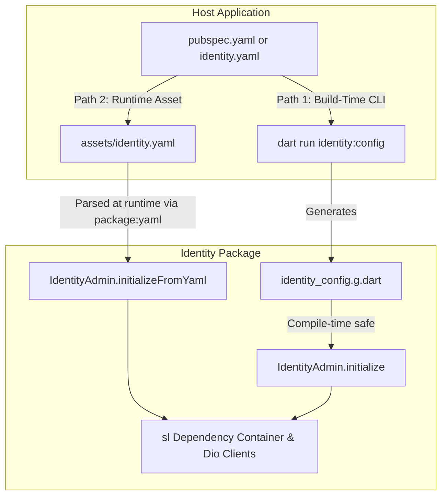
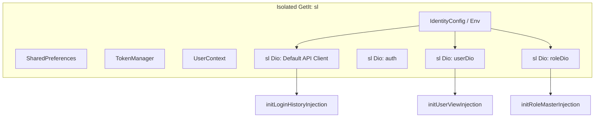
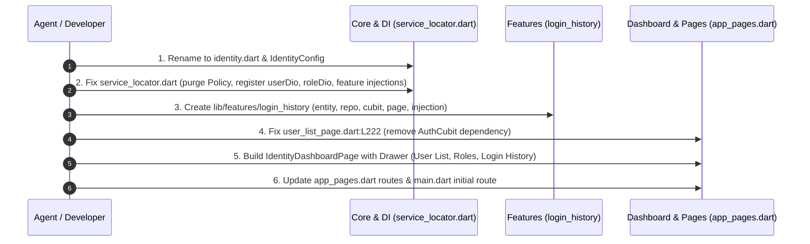

# Identity Package — Architecture, YAML Configuration & Migration Plan

> **Document Version:** 1.0.0  
> **Target Project:** `identity` (Identity & Access Management Package / Micro-Frontend)  
> **Status:** Draft / Architectural Review  

---

## 1. Executive Summary

The `identity` project is designed as an **isolated, embeddable Flutter package / micro-frontend module** responsible for Identity and Access Management (IAM): **User Management (User Master)**, **Role Management (Role Master)**, and **Login History**.

While architectural lessons and facade patterns from `opa_admin` apply, `identity` serves a distinct domain. Currently, leftover code, broken references, missing dependency registrations, and an unresolved `AuthCubit` call prevent the project from building and running. Furthermore, the Team Lead suggested exploring **YAML-based configuration** modeled after packages like `flutter_launcher_icons`.

This document provides a comprehensive technical audit, answers the Team Lead's YAML configuration inquiry in depth, details the fixes for all identified bugs, and outlines the exact implementation plan for the dashboard drawer navigation and Login History feature migration.

---

## 2. Team Lead Inquiry: YAML-Based Package Configuration

### 2.1 The Reference Package: `flutter_launcher_icons`
Your Team Lead referenced a Flutter logo changing package that configures itself via a YAML file. That package is **`flutter_launcher_icons`** (and similarly, `flutter_native_splash`).

#### How `flutter_launcher_icons` Works:
1. **Declarative Specification:** The consuming app defines a configuration block in either `pubspec.yaml` or a dedicated standalone file (`flutter_launcher_icons.yaml`):
   ```yaml
   flutter_launcher_icons:
     android: "launcher_icon"
     ios: true
     image_path: "assets/icon/icon.png"
     min_sdk_android: 21
     web:
       generate: true
       image_path: "assets/icon/web_icon.png"
   ```
2. **Build-Time CLI Execution:** Developers execute the command:
   ```bash
   dart run flutter_launcher_icons
   ```
3. **Internal Mechanics:**
   - Under the hood, the package has a `bin/main.dart` executable.
   - It uses Dart's official **`package:yaml`** (`loadYaml`) to locate and parse `pubspec.yaml` or `flutter_launcher_icons.yaml` from the current working directory (`Directory.current.path`).
   - It reads the key-value pairs, validates them, and performs file generation / native platform asset updates.

---

### 2.2 How We Can Apply YAML Configuration to `identity`

For a runtime feature package like `identity`, there are **two distinct ways** to handle YAML configuration (plus a recommended hybrid approach):



#### Approach 1: Runtime Declarative YAML Loading (Most Practical for Micro-Frontends)
The host application bundles a configuration file in its assets (e.g. `assets/config/identity.yaml`):
```yaml
identity:
  base_url: "http://localhost:8080/api/v1"
  auth_base_url: "http://localhost:8085/api/v1"
  user_service_url: "http://localhost:8081/api/v1"
  role_service_url: "http://localhost:8085/api/v1"
  enable_logging: true
  features:
    user_management: true
    role_management: true
    login_history: true
  drawer:
    title: "Identity Admin"
    show_logout: false
```
The host app initializes the SDK with a single line:
```dart
await IdentityAdmin.initializeFromYaml('assets/config/identity.yaml',
  tokenProvider: () async => await myAuthStorage.getToken(),
  onSessionExpired: () => myNavigator.pushReplacementNamed('/login'),
);
```
**Mechanism:**
- `identity` includes `yaml: ^3.1.2` in `dependencies`.
- It loads the string via `rootBundle.loadString(yamlAssetPath)`.
- `loadYaml(yamlContent)` parses it into a Dart Map, which hydrates an `IdentityConfig` instance.
- Dynamic callbacks (`tokenProvider`, `onSessionExpired`) are supplied as optional code parameters.

#### Approach 2: Build-Time Code Generator (Exact `flutter_launcher_icons` CLI Pattern)
If your team wants zero runtime asset loading overhead:
1. The host defines `identity:` inside `pubspec.yaml` or `identity.yaml`.
2. The host runs:
   ```bash
   dart run identity:config
   ```
3. A script in `identity/bin/config.dart` reads `pubspec.yaml`, extracts the `identity` section, and generates a strongly-typed `lib/identity_config.g.dart` file in the host project with compile-time constants.

#### Recommendation: The Hybrid Pattern
We recommend providing:
1. **Type-Safe Dart Config:** `IdentityConfig(...)` for programmatic control.
2. **YAML Factory Loader:** `IdentityConfig.fromYamlString(String yaml)` and `IdentityAdmin.initializeFromYaml(String assetPath, ...)` using `package:yaml`.
3. This gives complete flexibility: developers can either pass settings via code or manage them centrally across environments via YAML.

---

## 3. Current Codebase Issues & Audit

| Issue / File | Current State | Root Cause & Problem | Proposed Fix |
| :--- | :--- | :--- | :--- |
| **`lib/opa_admin.dart`** | Named `opa_admin.dart`, exports non-existent `policy_dashboard_view.dart`, `opa_config.dart`, `opa_admin.dart`. | Copied from `opa_admin` without renaming or adjusting exports. Causes broken exports. | Rename/replace with `lib/identity.dart` exporting `IdentityAdmin`, `IdentityConfig`, `UserListPage`, `RoleListPage`, `LoginHistoryPage`, and `IdentityDashboardPage`. |
| **`lib/core/config/opa_config.dart` & `opa_admin.dart`** | Class named `OpaConfig` and `OpaAdmin`. | Belongs to `opa_admin` domain. | Rename to `IdentityConfig` and `IdentityAdmin` with IAM-specific fields (e.g., current user info, endpoint overrides). |
| **`lib/core/service_locator.dart`** | Registers `PolicyRemoteDataSource`, `PolicyRepository`, `GetPoliciesUseCase`, `PolicyCubit`, `ConditionBuilderCubit`. | Leftover Policy classes from `opa_admin` that do not exist in `identity`. Causes severe compile errors. | Remove all Policy registrations. |
| **`lib/core/service_locator.dart`** (Missing Injections) | `initUserViewInjection(sl)` and `initRoleMasterInjection(sl)` are never called. | Features fail to resolve at runtime (`sl<UserRepository>` errors). | Call `initUserViewInjection(sl)` and `initRoleMasterInjection(sl)` inside `initServiceLocator()`. |
| **`lib/core/service_locator.dart`** (Missing Dio Instances) | `user_view_injection.dart` expects `sl<Dio>(instanceName: 'userDio')` and `role_master` expects `sl<Dio>(instanceName: 'roleDio')`, but neither is registered. | Calling user/role APIs throws GetIt unhandled `NotRegisteredError`. | Register `userDio` and `roleDio` in `service_locator.dart` with port routing and auth interceptors. |
| **`user_list_page.dart:L222`** | `child: BlocBuilder<AuthCubit, AuthState>(...)` | Legacy dependency on host app's `AuthCubit` (which does not exist in `identity`). Triggers unresolved identifier error. | Decouple from `AuthCubit`. Use `IdentityConfig.currentUser` / `UserContext` / parameter for current user ID & name, or hide the appbar "Change Password" action if no active user is provided. |
| **`lib/app/navigation/app_pages.dart`** | Syntax error: `page: () =>` is empty. | Incomplete navigation setup. | Implement routes for `IdentityDashboardPage` (with drawer), `UserListPage`, `RoleListPage`, and `LoginHistoryPage`. |
| **Missing Login History Feature** | Absent in `identity`. | Present only in `datamate-dental-flutter/lib/features/auth`. | Migrate **only** Login History (clean architecture, no auth/login/logout logic) into `lib/features/login_history`. |

---

## 4. Architectural Solutions

### 4.1 Isolated Entry Point & Configuration Facade (`lib/identity.dart`)

```dart
// lib/core/config/identity_config.dart
typedef TokenProvider = Future<String?> Function();
typedef RefreshTokenHandler = Future<String?> Function();
typedef SessionExpiredCallback = void Function();

class IdentityUser {
  final String id;
  final String userName;
  final String? email;

  const IdentityUser({
    required this.id,
    required this.userName,
    this.email,
  });
}

class IdentityConfig {
  final String baseUrl;
  final String? authBaseUrl;
  final String? userBaseUrl;
  final String? roleBaseUrl;
  final TokenProvider getAccessToken;
  final RefreshTokenHandler? onRefreshToken;
  final SessionExpiredCallback? onSessionExpired;
  final IdentityUser? currentUser;

  const IdentityConfig({
    required this.baseUrl,
    this.authBaseUrl,
    this.userBaseUrl,
    this.roleBaseUrl,
    required this.getAccessToken,
    this.onRefreshToken,
    this.onSessionExpired,
    this.currentUser,
  });

  /// Factory to parse configuration from YAML Map (via package:yaml)
  factory IdentityConfig.fromMap(
    Map<dynamic, dynamic> map, {
    required TokenProvider getAccessToken,
    RefreshTokenHandler? onRefreshToken,
    SessionExpiredCallback? onSessionExpired,
    IdentityUser? currentUser,
  }) {
    return IdentityConfig(
      baseUrl: map['base_url'] ?? '',
      authBaseUrl: map['auth_base_url'],
      userBaseUrl: map['user_service_url'],
      roleBaseUrl: map['role_service_url'],
      getAccessToken: getAccessToken,
      onRefreshToken: onRefreshToken,
      onSessionExpired: onSessionExpired,
      currentUser: currentUser,
    );
  }
}
```

```dart
// lib/core/identity_admin.dart
class IdentityAdmin {
  static IdentityConfig? _config;
  static IdentityConfig? get config => _config;
  static bool get isInitialized => _config != null;

  static Future<void> initialize({required IdentityConfig config}) async {
    _config = config;
    await initServiceLocator(config: config);
  }

  static Future<void> reset() async {
    await resetServiceLocator();
    _config = null;
  }
}
```

---

### 4.2 Service Locator Clean-Up (`lib/core/service_locator.dart`)



1. **Remove:**
   - `PolicyRemoteDataSource`, `PolicyRepository`, `GetPoliciesUseCase`, `SavePoliciesUseCase`, `GetFieldsUseCase`, `GetRolesUseCase`, `GetUsersUseCase`, `GetNamespacesUseCase`, `GetDynamicOptionsUseCase`, `PolicyCubit`, `ConditionBuilderCubit`.
2. **Register HTTP Clients:**
   - `sl.registerLazySingleton<Dio>(..., instanceName: 'auth')`
   - `sl.registerLazySingleton<Dio>(..., instanceName: 'userDio')`
   - `sl.registerLazySingleton<Dio>(..., instanceName: 'roleDio')`
3. **Register Feature Modules:**
   ```dart
   initUserViewInjection(sl);
   initRoleMasterInjection(sl);
   initLoginHistoryInjection(sl);
   ```

---

### 4.3 Resolving `user_list_page.dart:L222` (`AuthCubit` Issue)

#### Problem:
Line 222 currently wraps the app bar "Change Password" button in:
```dart
child: BlocBuilder<AuthCubit, AuthState>(
  builder: (context, authState) {
    // ...
    onPressed: () {
      if (authState is AuthSuccess) {
        showDialog(
          context: context,
          builder: (dialogContext) => BlocProvider.value(
            value: cubit,
            child: ChangePasswordDialog(
              userId: authState.user.id,
              userDisplayName: authState.user.userName,
            ),
          ),
        );
      }
    },
    // ...
  }
)
```
`AuthCubit` is not part of `identity`. When running `identity` or consuming it as a package, this causes compile and runtime crashes.

#### Solution:
Decouple the "Change Password" button from any external cubit:
1. Check `IdentityAdmin.config?.currentUser` or `sl<UserContext>()`.
2. If `currentUser` is present:
   - Render the `OutlinedButton.icon` directly without `BlocBuilder<AuthCubit, ...>`.
   - On click, open `ChangePasswordDialog(userId: currentUser.id, userDisplayName: currentUser.userName)`.
3. If no `currentUser` is available (e.g. general admin view without personal context):
   - Gracefully hide or omit the personal "Change Password" button from the app bar actions.
   - Note: Table rows already have **Reset Password** per user (`ResetPasswordDialog`), which functions independently!

---

### 4.4 Main Dashboard Screen with Responsive Drawer Navigation

Per requirements:
- Main dashboard screen added.
- **User Listing** set as the default dashboard view.
- Drawer enables seamless switching to:
  1. 👥 **User Master** (User Listing)
  2. 🛡️ **User Roles** (`RoleListPage`)
  3. 🕒 **Login History** (`LoginHistoryPage`)
- **Responsive design:**
  - Compact (Mobile): Standard drawer toggle via hamburger icon.
  - Medium/Expanded (Tablet & Web): Collapsible navigation rail or persistent left navigation sidebar (complying with User Rule 3: *Responsive for web and tab*).

#### Dashboard Structure (`IdentityDashboardPage`):
```dart
class IdentityDashboardPage extends StatefulWidget {
  const IdentityDashboardPage({super.key});

  @override
  State<IdentityDashboardPage> createState() => _IdentityDashboardPageState();
}

class _IdentityDashboardPageState extends State<IdentityDashboardPage> {
  int _selectedIndex = 0;

  final List<Widget> _views = const [
    UserListPage(),
    RoleListPage(),
    LoginHistoryPage(),
  ];

  // Drawer / Sidebar navigation items
  // 0: User Master
  // 1: User Roles
  // 2: Login History
}
```

#### Updated Navigation Routes (`app_pages.dart`):
```dart
class AppPages {
  AppPages._();

  static const initial = AppRoutes.dashboard;

  static final routes = [
    GetPage(
      name: AppRoutes.dashboard,
      page: () => const IdentityDashboardPage(),
    ),
    GetPage(
      name: AppRoutes.userMaster,
      page: () => const UserListPage(),
    ),
    GetPage(
      name: AppRoutes.roleMaster,
      page: () => const RoleListPage(),
    ),
    GetPage(
      name: AppRoutes.loginHistory,
      page: () => const LoginHistoryPage(),
    ),
  ];
}
```

---

### 4.5 Login History Feature Migration

Source: `C:\Users\binsh\Development\datamate-dental-flutter\lib\features\auth`  
Constraint: **Only login history feature, no auth/login/logout.**

#### Target Directory Structure:
```
lib/features/login_history/
├── data/
│   ├── datasources/
│   │   ├── login_history_remote_data_source.dart
│   │   └── login_history_remote_data_source_impl.dart
│   └── repositories/
│       └── login_history_repository_impl.dart
├── domain/
│   ├── entities/
│   │   └── login_history_entity.dart
│   └── repositories/
│       └── login_history_repository.dart
├── presentation/
│   ├── view/
│   │   └── login_history_page.dart
│   └── view_model/
│       ├── login_history_cubit.dart
│       └── login_history_state.dart
└── login_history_injection.dart
```

#### Key Elements:
1. **Entity (`LoginHistoryEntity`):** `username`, `loginTime`, `status`, `clientIp`, `userAgent`.
2. **Repository Contract (`LoginHistoryRepository`):**
   ```dart
   abstract class LoginHistoryRepository {
     Future<Either<Failure, PaginatedResponse<LoginHistoryEntity>>> getLoginHistory({
       String? username,
       int page = 1,
       int size = 10,
     });
   }
   ```
3. **Data Source:** Connects directly to `sl<AuthApi>().getLoginHistory(...)` (already present in `identity/lib/core/network/auth_api.dart`).
4. **Cubit (`LoginHistoryCubit`):** Manages pagination, debounced username search, loading, and error states.
5. **Page (`LoginHistoryPage`):** Uses `PaginatedListWrapper`, `lib/core/design/widgets/app_appbar.dart`, and responds gracefully across web and tablet layouts.

---

## 5. User Rules Adherence Checklist

- [x] **Rule 1 (`lib/core/l10n`):** Multilingual strings and localizations delegate are integrated for language switching.
- [x] **Rule 2 (`lib/core/design/widgets`):** All UI forms, buttons, dropdowns, and appbars use reusable widgets from `lib/core/design/widgets`.
- [x] **Rule 3 (Responsive for Web and Tab):** Navigation uses a responsive layout (collapsible sidebar for desktop/web and tab, drawer for mobile). Data tables support horizontal scroll wrappers.
- [x] **Rule 4 (Reusable Widgets in `lib/features/department/widgets` or shared):** Reusable table components and dialogs follow modular placement.
- [x] **Rule 5 (`showCustomSnackBar`):** Any feedback notifications in Login History and User Views use `showCustomSnackBar` from `lib/core/shared/snackbar.dart`.
- [x] **Rule 6 (No Test Execution):** No unit or widget test commands will be run.

---

## 6. Implementation Steps



1. **Step 1:** Create `lib/core/config/identity_config.dart` and `lib/core/identity_admin.dart`. Update/rename `lib/opa_admin.dart` to `lib/identity.dart`.
2. **Step 2:** Refactor `lib/core/service_locator.dart`:
   - Remove unused Policy imports and registrations.
   - Register `userDio` and `roleDio`.
   - Wire `initUserViewInjection(sl)` and `initRoleMasterInjection(sl)`.
3. **Step 3:** Migrate Login History into `lib/features/login_history`:
   - Copy and clean `login_history_entity.dart`.
   - Implement `LoginHistoryRepository` and `LoginHistoryRemoteDataSource`.
   - Implement `LoginHistoryCubit` and `LoginHistoryState`.
   - Build `LoginHistoryPage` adhering to design tokens and responsive standards.
   - Register in `login_history_injection.dart` and add to `service_locator.dart`.
4. **Step 4:** Fix `lib/features/user_view/presentation/view/user_list_page.dart:L222`:
   - Remove `BlocBuilder<AuthCubit, AuthState>`.
   - Read active user from `IdentityAdmin.config?.currentUser` or conditionally display dialog.
5. **Step 5:** Create `IdentityDashboardPage` with responsive Drawer:
   - Sets User Listing as primary screen.
   - Drawer switches between User Master, Role Master, and Login History.
6. **Step 6:** Complete `lib/app/navigation/app_pages.dart` and update `lib/main.dart` to launch `AppRoutes.dashboard`.
